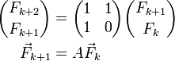

### Задача 05-16: Апельсин

  -------------------------------------- ------
  **Ограничение времени:**               1 с
  **Ограничение памяти:**                64 M
  **Максимальное количество посылок:**   32
  -------------------------------------- ------

К Вам на улице подходит незнакомец и говорит, что всем известно
эффективное решение задачи вычисления i-ого члена последовательности
Фибоначчи по модулю числа p^\*^. Однако, теперь его интересует более
общая задача для произвольной линейной рекуррентной последовательности,
заданной формулой\
F~n~ = A~1~ \* F~n-1~ + ... + A~k~F~n-k~.\
Не в силах противостоять ему, Вы решаете помочь. Ваша задача посчитать
F~N~ mod p.

Входные данные имеют следующий формат. Сначала идут целые положительные
числа k, N, p каждое с новой строки.2 ≤ k ≤ 10, N ≤ 2\*10^9^, p ≤
2\*10^5^. В следующей строке содержатся первые k членов данной
последовательности F~1~..F~k~. Каждое число целое неотрицательное и не
превосходит 10^5^. В последней строке файла содержатся коэффициенты
A~1~..A~k~. Каждое число целое неотрицательное и не превосходит 10^5^.

\*) Подсказка:\

### Примеры

|-----------------------------------|-----------------------------------|
| **Входные данные**                | **Результат работы**              |
|-----------------------------------|-----------------------------------|
| 2 10000000 1000 1 1 1 1 |     875                           |
|-----------------------------------|-----------------------------------|
| 3 5 100 1 2 3 4 5 6 |     39                            |
|-----------------------------------|-----------------------------------|

### Сдать решение
