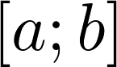
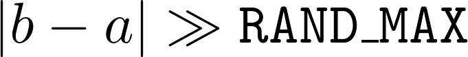
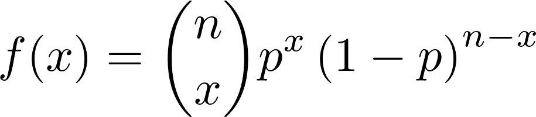

{:start="17"}
17. [***Программа***](../programs)
    - Реализовать функцию, принимающую на вход границы отрезка {: style="height:1.5em; vertical-align:bottom"} -- числа с плавающей точкой (двойной точности).
    - Функция должна вернуть псевдослучайное действительное число из заданного отрезка.
    - Используйте функцию `int rand(void)`.
    - Функция *не* должна устанавливать зерно генератора случайных чисел.
    - Распределение вероятностей чисел должно быть равномерным на всем отрезке {: style="height:1.5em; vertical-align:bottom"}.
    - Учтите, что поскольку `rand()` возвращает `int`, *наивная* реализация может привести к тому, что некоторые числа никогда не будут получены. При этом, такое поведение может быть незаметным для невооруженного взгляда, так как случайные числа формируют равномерную *сетку*. Такое поведение особенно заметно, если {: style="height:1.4em; vertical-align:bottom"}.
    - Избегайте неопределенного поведения.
18. [***Программа***](../programs)
    - Реализовать функцию, принимающую на вход
        - `p` -- вероятность удачного эксперимента.
        - `n` -- количество экспериментов в одном тесте.
    - Функция дожна вернуть указатель на строку, в динамической памяти, содержащую [ASCII-изображение](https://ru.wikipedia.org/wiki/ASCII-графика).
    - На изображении должен быть график [биномиального распределения](https://ru.wikipedia.org/wiki/Биномиальное_распределение), для заданных значений `p` и `n`.
    - Другими словами, график функции {: style="height:3.2em; margin: 0 auto; display: block;"}
    - Однако использовать аналитически полученные формулы **запрещается**, все результаты и значения должны быть получены *эмпирически*, то есть за счет проведения множества тестов и сбора статистических данных!
    - Оформление ASCII-изображения остается на усмотрение студента.
    - Так, например, изображение для `n = 12` и `p = 0.5` может выглядеть примерно так:
    ```
    ^             #
    |             #
    |           # # #
    |           # # #
    |           # # #
    |         # # # # #
    |         # # # # #
    |         # # # # #
    |         # # # # #
    |       # # # # # # #
    |       # # # # # # #
    | # # # # # # # # # # # # #
    +---------------------------->
    ```
