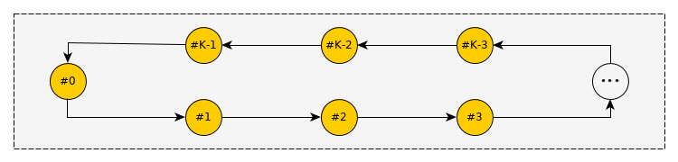
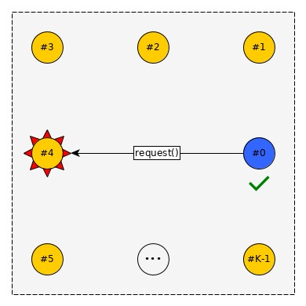
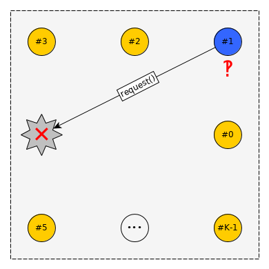
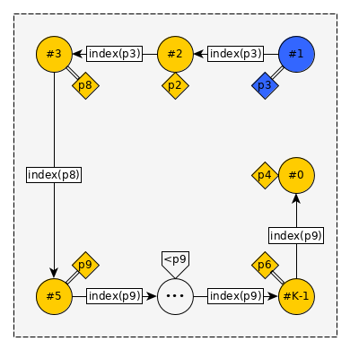
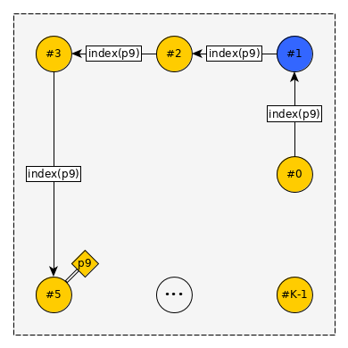
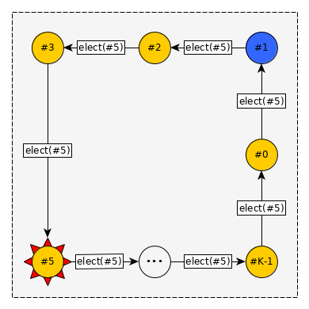
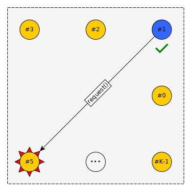

{:start="22"}
22. [***Программа***](../programs)
    - Реализовать программу, создающую сеть из `K` упорядоченных процессов.
    - Каждый из процессов должен иметь выделенный канал связи с 2 соседями.
    - Тогда топология сети будет следущая:
        
    - Изначально процесс `0` должен отправить процессу `1` некое число `N` по каналу связи.
    - Процесс `i`, получив по каналу связи число `t` должен отправить число `t-1` процессу `i+1`.
    - Если число полученное по каналу -- меньше `1`, то следует завершить работу всей программы.
    - Главный процесс (запускаемый исполняемым файлом) не относится к сети процессов.
    - После завершения программы не должно отсаться процессов-зомби.
    - Числа `K` и `N` -- известны только в момент выполнения программы.
23. [***Программа***](../programs) **Задание со ✪.**
    - Реализовать программу, создающую сеть из `K` упорядоченных процессов.
    - Каждый процесс имеет приоритет -- уникальное целое число, в общем случае не совпадающее с номером процесса.
    - Гарантируется, что приоритет процесса не меняется во время выполнения программы.
    - Считается, что сеть процессов не стабильна и любой процесс может непредвиденно завершиться (например, `kill pid`).
    - **Распределитель**:
         
        - В сети выбирается процесс с максимальным приоритетом -- распределитель, ответственный за некоторый ресурс.
        - Все другие процессы должны отправлять запросы распределителю, если они хотят получить доступ к ресурсу.
        - Если распределитель непредвиденно завершился, то после неудачного запроса, запускается процедура выборов.
    - **Выборы**:
         
        - Процесс, запустивший выборы отправляет следующему процессу запрос индексации со своим приоритетом.
        - Любой процесс, получивший запрос индексации, сверяет приоритет из запроса со своим приоритетом.
            - Если приоритеты отличаются, то отправляется запрос с большим приоритетом следующему процессу.
            - Если приоритеты совпали, то выборы закончены и происходит оглашение номера нового распределителя.
    - **Оглашение результатов**:
         
        - Процессы передают информацию о новом распределителе.
        - Процесс совершивший неудачный запрос должен снова попробовать совершить запрос.
    - Главный процесс (запускаемый исполняемым файлом) не относится к сети процессов.
    - После завершения программы не должно отсаться процессов-зомби.
    - Количество процессов `K` -- известно только в момент выполнения программы.
    - Обратите внимание, что если реализовывать каналы связи, используя `pipe()` для каждого канала, то потребуется `2*(K-1)!` открытых файловых дескрипторов. Следует как-то уменьшить количество нужных дескрипторов или использовать иную реализацию каналов связи между процессами.
