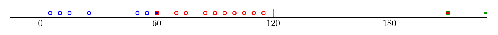
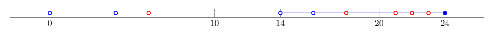
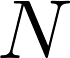
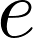

{:start="15"}
15. [***Программа***](../programs)
    - Реализовать функцию, принимающую на вход "цену" -- число с плавающей точкой (двойной точности).
    - Если функция была вызвана в первый раз за текущую минуту по Гринвичу, то программа должна распечатать на стандартный поток вывода информацию о цене за последнюю минуту, о которой у нас имеется информация.
    - На данной картинке точками показаны времена вызовов функции. Закрашенные точки привели к выведению информации точек своего цвета. Сами закрашенные точки будут выведены вместе со следующим набором.
    - Информация о цене включает в себя:
        - Среднее арифметическое цен за период.
        - Минимальное и максимальное значения цены за период.
        - **Задание со ✪.** Стандартное отклонение цен за период.
    - Время должно замеряться в секундах, относительно 01 января 1970.
    - Обратите внимание, что функция может вызываться больше одного раза в секунду.
    - Формат вывода -- на усмотрение студента.
16. [***Программа***](../programs)
    - Реализовать функцию, принимающую на вход "событие" с неких датчиков -- либо Фото-событие, либо Аудио-событие.
    - Функция должна предупреждать пользователя, если за последние 10 секунд произошло:
        - Как минимум 3 Фото-события и
        - Как минимум 2 Аудио-события.
    - На данной картинке, события, соответствующие выколотым точкам не вызвали сообщений, а последнее Фото-событие, соответствующее закрашенной точке -- вызвало, так как за последние 10 секунд зарегистрировано 3 Фото и 4 Аудио события.
    - Обратите внимание, что функция может вызываться больше одного раза в секунду.
    - Способ "предупреждения пользователя" -- на усмотрение студента. (Будьте [настойчивы](./ALART.png), пользователь должен знать.)
    - **Задание со ✪.** Обдумайте, как изменился бы код вашей программы, если бы к датчикам добавились Счетчик Гейгера и Детектор Сарказма. Попробуйте реализовать версию программы, в которой существует множество различных несвязанных событий {: style="height:1em"}, а активация Предупреждения происходит при достижении количества событий заданного константами {: style="height:1em"}{: style="height:.75em; vertical-align:text-bottom"} ({: style="height:1em"}) за последние {: style="height:1em"} секунд. При чем значения {: style="height:1em"}, {: style="height:1em"} и {: style="height:1em"} известны только в момент компиляции конечным пользователем.
{::comment}
vim: wrap linebreak
{:/comment}
