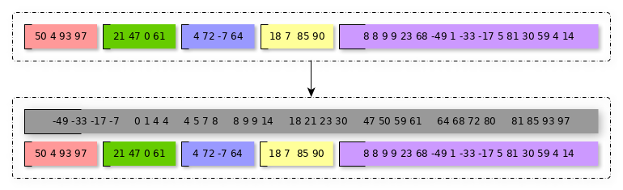
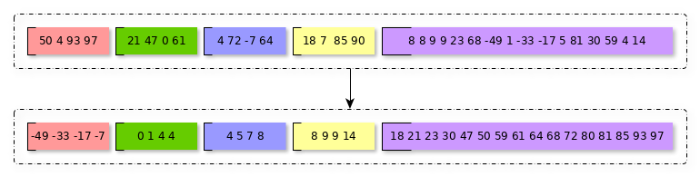

{:start="19"}
19. Выясните, что происходит с дескрипторами файлов, при вызове `fork()`.
    - Протестируйте данное поведение на своей системе при чтении или записи в файл.
    - **Задание со ✪.**
        - Разберитесь, как организуется такое поведение.
        - Почему данные о файле ведут себя иначе при вызове `fork()`, нежели данные в обычных переменных?
20. [***Программа***](../programs)
    - Реализовать функцию, принимающую на вход список путей до файлов.
    - В файлах подряд записаны значения `double`, начиная с нулевого байта.
    - Размер фалов кратен `sizeof(double)`.
    - Считается, что порядок байтов в файле и в локальной системе совпадают.
    - Среди значений `double` гарантированно не находятся `NaN`.
    - Функция должна вернуть наименьшее значение из всех файлов.
    - Размер файлов может быть крайне велик, но гарантируется, что суммарный размер файлов представим типом `size_t`.
    - Можно считать, что файлы находятся на разных физических устройствах.
    - Требуется оптимизировать алгоритм, используя `fork()`.
    - Если в момент компиляции определен символ `K`, то программа должна использовать не больше `K` процессов.
    - Учтите, что размер файлов может сильно варьироваться. Разделение труда между детьми пофайлово не оптимально.
21. [***Программа***](../programs) (**Задание со ✪.**)
    Те же условия, что и в задании 20, но:
    - Функция должна отсортировать значения во всех файлах.
    - Либо создать новый файл и разместить отсортированные значения в него.
        (В таком случае исходные файлы должны быть оставлены без изменений)
        
    - Либо сохранить отсортированный массив обратно в файлы в порядке следования имен файлов.
        
{::comment}
vim: wrap linebreak
{:/comment}
